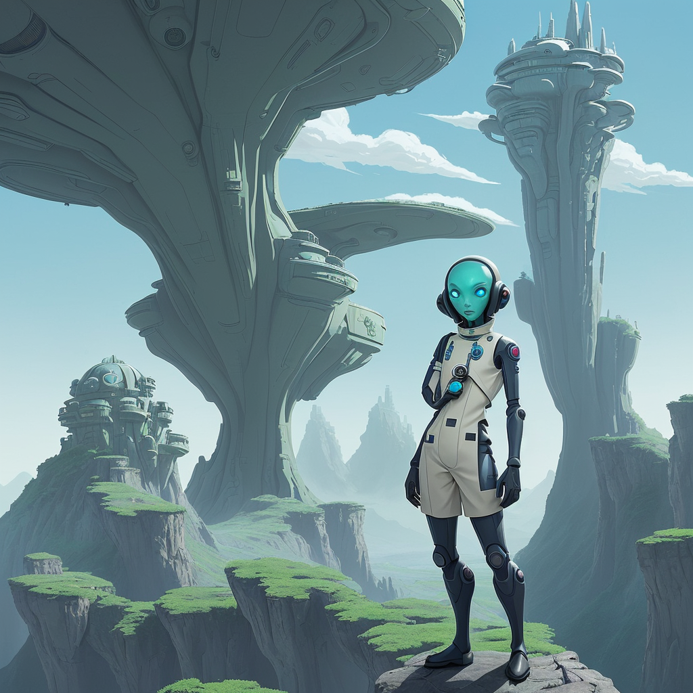

### 📷 87feb8400370fd9d1a5946f6026a323c 

| Field          | Value                                                                                                                     |
|----------------|---------------------------------------------------------------------------------------------------------------------------|
| **Image ID**             | 87feb8400370fd9d1a5946f6026a323c                                                                                                             |
| **Title**           | Futuristic Alien Medic at Alien Fortress                                                                                                       |
| **Description**           | Create a landscape full body image of a futuristic alien medic in the style of Studio Ghibli against the backdrop of a alien fortress                                                                                                       |
| **CreatedAt**        | 2024-12-15 18:01:28.567976                                                                                                        |
| **Model**        | stablediffusion                                                                                                        |
| **OpenAI**         | [OpenAI Image URL](http://192.168.1.85:8081/generated-images/b644050169027.png)                                                                                |
| **GitHub**         | [GitHub Image URL](https://raw.githubusercontent.com/Caneta-Silva/studio-ghibli/refs/heads/main/images/87feb8400370fd9d1a5946f6026a323c/87feb8400370fd9d1a5946f6026a323c.jpg)                                                                                |
| **Tags**       | None                                                                                                                   |

### 📜 f8d3270fe5074cb22e97635a9f12515b

> Create a landscape full body image of a futuristic alien medic in the style of Studio Ghibli against the backdrop of a alien fortress

| Field          | Value                                                                                                                                                                      |
|----------------|----------------------------------------------------------------------------------------------------------------------------------------------------------------------------|
| **Prompt ID**  | f8d3270fe5074cb22e97635a9f12515b                                                                                                                                                            |
| **Prompt History** | <ul><li>**Input:**    **Output:**    **Type:** </li></ul> |
| **Created At** |                                                                                                                                                    |
| **Revised At** | None                                                                                                                                                   |
| **Revised Prompt** | No                                                                                                                                                                      |
| **Enhanced At** | None                                                                                                                                                  |
| **Enhanced Prompt** | No                                                                                                                                                                    |
| **Metadata**   | <ul><li>**Element:** medic   **Style:** Studio Ghibli   **Aspect Ratio:** landscape   **Backdrop:** fortress   **Animal:** elephant   **Modifiers:**<ul><li>**Image:** full body</li><li>**Element:** futuristic alien</li><li>**Backdrop:** alien</li></ul></li></ul> |
| **Template**   | Create a {{ aspect_ratio }} {{ modifiers.image }} image of a {{ modifiers.element }} {{ element }} in the style of {{ style }} against the backdrop of a {{ modifiers.backdrop }} {{ backdrop }}                                                                                                                                           |

