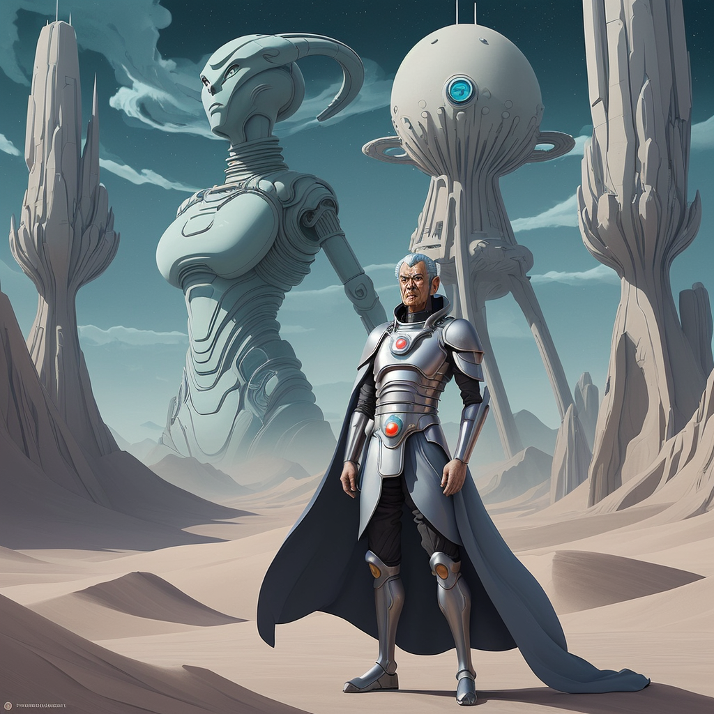

### 📷 c0c89590d8b94247a037efc75827ca5a 

| Field          | Value                                                                                                                     |
|----------------|---------------------------------------------------------------------------------------------------------------------------|
| **Image ID**             | c0c89590d8b94247a037efc75827ca5a                                                                                                             |
| **Title**           | The Futuristic Emperor of the Alien Desert                                                                                                       |
| **Description**           | Create a landscape full body image of a futuristic emperor in the style of Studio Ghibli against the backdrop of a futuristic alien desert                                                                                                       |
| **CreatedAt**        | 2024-12-18 16:57:31.692154                                                                                                        |
| **Model**        | dreamshaper                                                                                                        |
| **OpenAI**         | [OpenAI Image URL](http://192.168.1.85:8081/generated-images/b643834167182.png)                                                                                |
| **GitHub**         | [GitHub Image URL](https://raw.githubusercontent.com/Caneta-Silva/studio-ghibli/refs/heads/main/images/c0c89590d8b94247a037efc75827ca5a/c0c89590d8b94247a037efc75827ca5a.jpg)                                                                                |
| **Tags**       | None                                                                                                                   |

### 📜 97f866599bee05797164f9103b317ca5

> Create a landscape full body image of a futuristic emperor in the style of Studio Ghibli against the backdrop of a futuristic alien desert

| Field          | Value                                                                                                                                                                      |
|----------------|----------------------------------------------------------------------------------------------------------------------------------------------------------------------------|
| **Prompt ID**  | 97f866599bee05797164f9103b317ca5                                                                                                                                                            |
| **Prompt History** | <ul><li>**Input:**    **Output:**    **Type:** </li></ul> |
| **Created At** |                                                                                                                                                    |
| **Revised At** | None                                                                                                                                                   |
| **Revised Prompt** | No                                                                                                                                                                      |
| **Enhanced At** | None                                                                                                                                                  |
| **Enhanced Prompt** | No                                                                                                                                                                    |
| **Metadata**   | <ul><li>**Element:** emperor   **Style:** Studio Ghibli   **Aspect Ratio:** landscape   **Backdrop:** desert   **Animal:** elephant   **Modifiers:**<ul><li>**Image:** full body</li><li>**Element:** futuristic</li><li>**Backdrop:** futuristic alien</li></ul></li></ul> |
| **Template**   | Create a {{ aspect_ratio }} {{ modifiers.image }} image of a {{ modifiers.element }} {{ element }} in the style of {{ style }} against the backdrop of a {{ modifiers.backdrop }} {{ backdrop }}                                                                                                                                           |

