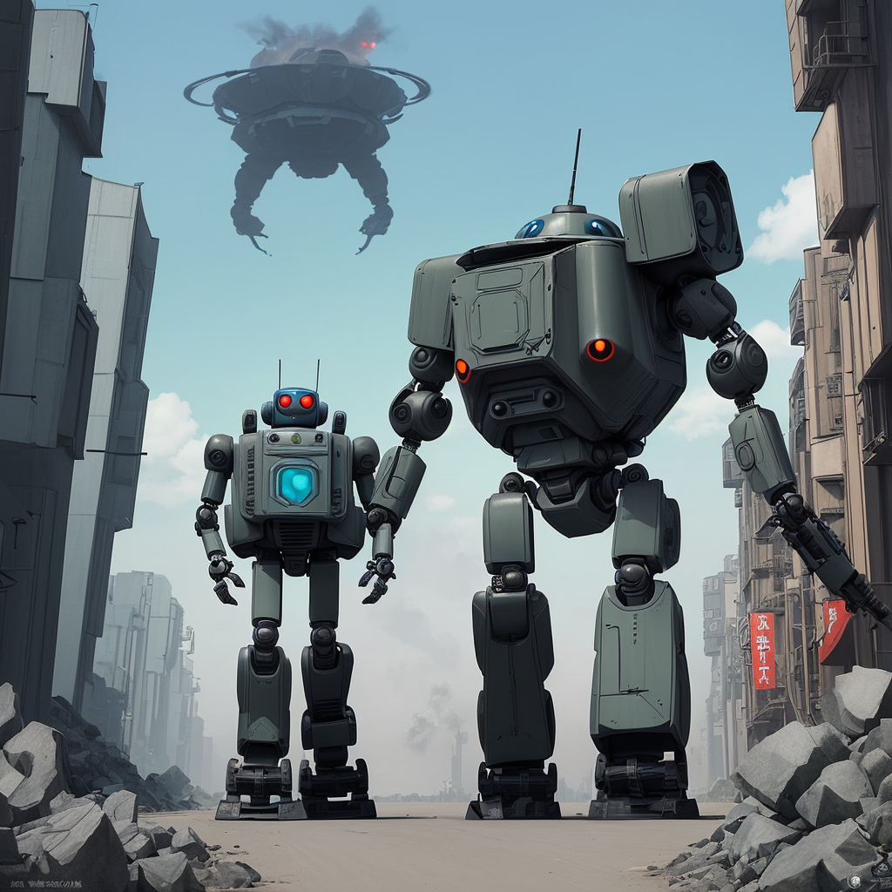

### 📷 e5012767ee3a05dfe9640a11da72e0bd 

| Field          | Value                                                                                                                     |
|----------------|---------------------------------------------------------------------------------------------------------------------------|
| **Image ID**             | e5012767ee3a05dfe9640a11da72e0bd                                                                                                             |
| **Title**           | The Enforcer of the Galactic Peace                                                                                                       |
| **Description**           | Create a landscape full body image of a alien riot police robot in the style of Studio Ghibli                                                                                                       |
| **CreatedAt**        | 2024-12-21 00:57:10.728637                                                                                                        |
| **Model**        | dreamshaper                                                                                                        |
| **OpenAI**         | [OpenAI Image URL](http://192.168.1.85:8081/generated-images/b643124499238.png)                                                                                |
| **GitHub**         | [GitHub Image URL](https://raw.githubusercontent.com/Caneta-Silva/studio-ghibli/refs/heads/main/images/e5012767ee3a05dfe9640a11da72e0bd/e5012767ee3a05dfe9640a11da72e0bd.jpg)                                                                                |
| **Tags**       | None                                                                                                                   |

### 📜 16203aacdf9c5fbedf30e4fb4aedc79f

> Create a landscape full body image of a alien riot police robot in the style of Studio Ghibli

| Field          | Value                                                                                                                                                                      |
|----------------|----------------------------------------------------------------------------------------------------------------------------------------------------------------------------|
| **Prompt ID**  | 16203aacdf9c5fbedf30e4fb4aedc79f                                                                                                                                                            |
| **Prompt History** | <ul><li>**Input:**    **Output:**    **Type:** </li></ul> |
| **Created At** |                                                                                                                                                    |
| **Revised At** | None                                                                                                                                                   |
| **Revised Prompt** | No                                                                                                                                                                      |
| **Enhanced At** | None                                                                                                                                                  |
| **Enhanced Prompt** | No                                                                                                                                                                    |

| **Template**   | Create a {{ aspect_ratio }} {{ modifiers.image }} image of a {{ modifiers.element }} {{ element }} in the style of {{ style }}                                                                                                                                           |

